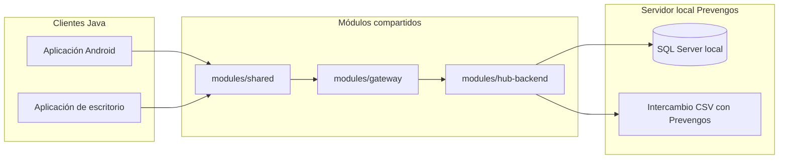

# Prevengos Plug

## Visión general
Prevengos Plug es un programa 100 % Java pensado para ejecutarse en entornos controlados de Prevengos. El objetivo es ofrecer una herramienta local que permita capturar datos de pacientes desde la app Android y la aplicación de escritorio, almacenarlos en la base de datos SQL Server del servidor de Prevengos y sincronizarlos con la plataforma oficial a través de intercambios CSV. Toda la mensajería, analítica avanzada o automatización multicanal se delega en repositorios externos —como [`prl-notifier`](https://github.com/prevengos/prl-notifier)— para evitar duplicar responsabilidades.

El monorepo agrupa las aplicaciones cliente y los módulos Java compartidos que encapsulan contratos, lógica de sincronización y acceso a datos. No existe motor Python, ni código Kotlin, ni adaptadores de terceros incluidos: el alcance se limita a la sincronización local con Prevengos y al mantenimiento de consistencia entre los clientes Java y la base de datos corporativa.

## Principios clave
- **Sincronización local controlada**: todas las operaciones de lectura y escritura se realizan contra SQL Server local y los CSV intercambiados con Prevengos.
- **Tecnología homogénea**: solo se utiliza Java tanto en los clientes como en los módulos compartidos para simplificar despliegues y soporte.
- **Responsabilidades claras**: la mensajería, notificaciones y automatizaciones externas viven fuera de este repositorio y se integran únicamente a través de CSV o procesos coordinados.
- **Reutilización entre clientes**: los módulos compartidos definen contratos y utilidades comunes para Android y escritorio, evitando divergencias en el modelo de datos.

## Base de datos oficial

El hub opera sobre SQL Server como única fuente de verdad. El entorno
`infra/local-hub` levanta SQL Server y el backend Java mediante Docker Compose y
crea automáticamente la base y el usuario de aplicación. PostgreSQL solo se
mantiene como sustituto temporal en pruebas automatizadas o pipelines que aún no
pueden apuntar a SQL Server; dichos artefactos están documentados en
[`infra/postgresql`](infra/postgresql/README.md).

## Diagrama lógico

El diagrama refleja que las apps Java se apoyan en módulos compartidos para persistir información en SQL Server y generar o consumir los CSV requeridos por Prevengos. Cualquier otro canal (mensajería, email, analítica o integraciones externas) debe implementarse en sistemas anexos y coordinarse mediante los mismos CSV o la base de datos local.

## Guía de implementación

La [Guía de implementación](docs/guia-de-implementacion.md) recopila los módulos principales, flujos de datos y controles de seguridad que deben seguir los equipos de Android, escritorio y backend al trabajar con Prevengos Plug. Consulta ese documento antes de acometer nuevos desarrollos o despliegues para mantener la coherencia con la arquitectura acordada.

## Documentación clave

- **Puesta en marcha unificada:** [`docs/quickstart.md`](docs/quickstart.md) cubre requisitos, despliegue local con SQL Server, pruebas y validaciones.
- **Recorridos manuales en local:** [`docs/operations/local-testing.md`](docs/operations/local-testing.md) resume cómo levantar el hub con Docker, inyectar payloads y validar resultados sobre SQL Server o PostgreSQL de soporte.
- **Formatos CSV oficiales:** [`docs/integrations/csv-formatos.md`](docs/integrations/csv-formatos.md) y las plantillas en [`contracts/csv/rrhh`](contracts/csv/rrhh/README.md) definen columnas, ejemplos y reglas de checksum.
- **Automatización de intercambio:** [`docs/operations/csv-automation.md`](docs/operations/csv-automation.md) describe los jobs recomendados para entregar y recibir CSV sin intervención manual.
- **Checklists de calidad:** [`docs/quality/manual-sync-checklist.md`](docs/quality/manual-sync-checklist.md) guía las validaciones end-to-end en SQL Server.

## Roadmap de clientes

> Este roadmap se sincroniza con el backlog de tickets del repositorio y se actualizará a medida que los clientes móviles y de escritorio avancen en su implementación.

### Aplicación Android

- [ ] Crear el módulo base de UI y navegación (pantalla de login, listados y formularios) alineado con los contratos de `modules/shared`.
- [ ] Implementar `SyncRepository` con almacenamiento local en Room y llamadas reales al hub (`/sincronizacion/push` y `/sincronizacion/pull`).
- [ ] Añadir capa de autenticación y manejo de errores de red con reintentos y registros operativos.
- [ ] Configurar pipelines de build y pruebas (`assemble`, `bundle`, tests unitarios e instrumentados) listos para distribución interna.

### Aplicación de escritorio

- [ ] Definir la estructura de proyecto JavaFX y la persistencia local (SQLite) reutilizando los contratos compartidos.
- [ ] Implementar servicios de sincronización con el hub y reconciliación de tokens.
- [ ] Construir la interfaz principal (listados, detalles y edición) y los flujos de importación/exportación offline.
- [ ] Preparar tareas Gradle para empaquetado (`fatJar`, instaladores) y la suite de pruebas automatizadas.

## Recursos operativos

- Plantilla de variables compartidas en [`.env.sample`](./.env.sample) para alinear la configuración del hub con otros repositorios (incluido `prl-notifier`).
- Mock HTTP de la API del Hub en [`infra/mocks/prl-hub`](infra/mocks/prl-hub) respaldado por Prism y sincronizado con el OpenAPI versionado.
