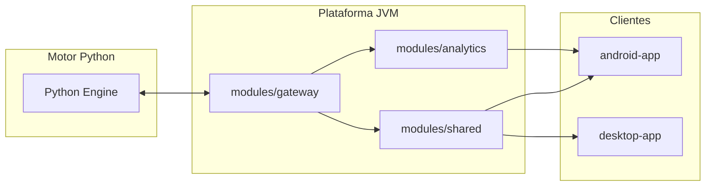

# Prevengos Plug

## Visión general
Prevengos Plug es una plataforma híbrida que combina un motor de análisis en Python con aplicaciones cliente multiplataforma escritas en Kotlin y Java. El objetivo es ofrecer herramientas de prevención de riesgos laborales reutilizables, seguras y fáciles de desplegar, permitiendo iteraciones rápidas entre equipos de datos, producto y desarrollo.

La solución se organiza en torno a un repositorio monorepo que alberga todos los artefactos: componentes compartidos, aplicaciones finales y el motor de cálculo especializado. El esqueleto se basa en Gradle con Kotlin DSL para orquestar dependencias y tareas de construcción tanto para módulos Java/Kotlin como para integraciones con el motor Python.

## Principios clave
- **Modularidad evolutiva**: cada responsabilidad reside en un módulo aislado que puede versionarse y desplegarse de forma independiente.
- **Paridad de entornos**: los scripts de construcción reproducen el mismo comportamiento en CI, entornos locales y despliegues automatizados.
- **Interoperabilidad**: los límites entre JVM y Python se definen mediante interfaces bien documentadas para garantizar integraciones predecibles.
- **Observabilidad desde el inicio**: se habilitan puntos de instrumentación comunes para telemetría, trazas y registros desde los módulos compartidos.
- **Seguridad por diseño**: se establecen políticas de dependencia, revisión de código y escaneos automáticos como parte del flujo de CI/CD.

## Diagrama lógico

El diagrama muestra cómo el motor Python se integra a través de un módulo gateway que expone las capacidades analíticas al resto de módulos JVM. Los módulos compartidos suministran contratos y utilidades comunes para las aplicaciones Android y desktop, garantizando consistencia funcional desde el día uno.

## Próximos pasos sugeridos
1. Definir contratos de comunicación entre `python-engine` y `modules/gateway` (p. ej. gRPC o REST).
2. Añadir configuraciones específicas en `android-app` y `desktop-app` para gestionar dependencias móviles y de escritorio.
3. Implementar pipelines de CI que validen tanto el código Kotlin/Java como los componentes Python.
