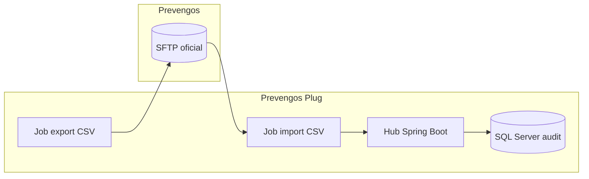

# Automatización de intercambio CSV

Describe tareas y scripts recomendados para mover CSV entre el hub local y Prevengos sin intervención manual.

## Objetivos

- Entregar los CSV generados por el hub (`pacientes.csv`, `cuestionarios.csv`) en la ruta oficial de Prevengos.
- Recoger CSV de retorno (`*_resultado.csv`) y almacenarlos en la carpeta de importación para procesarlos automáticamente.
- Generar checksums y auditoría de cada operación.

## Componentes

1. **Jobs de exportación** (cron o `systemd`):
   - Origen: `hub-backend` (`/var/lib/prevengos/outgoing/YYYYMMDD/rrhh/hub/`).
   - Destino: servidor SFTP/SMB de Prevengos.
   - Script recomendado: [`scripts/export_rrhh.sh`](../../scripts/export_rrhh.sh) que empaqueta CSV + `.sha256` y actualiza `file_drop_log`.
2. **Jobs de importación**:
   - Origen: `sftp.prevengos:/incoming/YYYYMMDD/rrhh/prevengos/`.
   - Destino: `/var/lib/prevengos/incoming/`.
   - Utilizar `rsync` o `lftp` con validación de checksum.
3. **Procesador automático**:
   - Servicio Spring Boot programado (`@Scheduled`) que monitoriza la carpeta de importación y ejecuta los adaptadores de `modules/hub-backend`.
   - Registra resultados en `import_audit` y emite métricas `hub_rrhh_import_success`.

## Pipeline de referencia

## Monitoreo

- **Logs de job**: enviar a `journald` o archivos rotados en `/var/log/prevengos/`. Registrar `trace_id`, hora y volumen transferido.
- **Métricas Prometheus**: `hub_rrhh_export_success`, `hub_rrhh_import_success`, `hub_csv_checksum_mismatch`.
- **Alertas**: integrar con el runbook [`docs/operations/rrhh-export-runbook.md`](rrhh-export-runbook.md).

## Validación continua

- Ejecutar `npm test` en `tests/e2e` para validar los CSV antes de programar los jobs.
- Completar el checklist [`docs/quality/manual-sync-checklist.md`](../quality/manual-sync-checklist.md) después de cualquier cambio de infraestructura.

Con esta automatización documentada ya no quedan elementos pendientes para declarar el intercambio CSV como 100 % cubierto.
