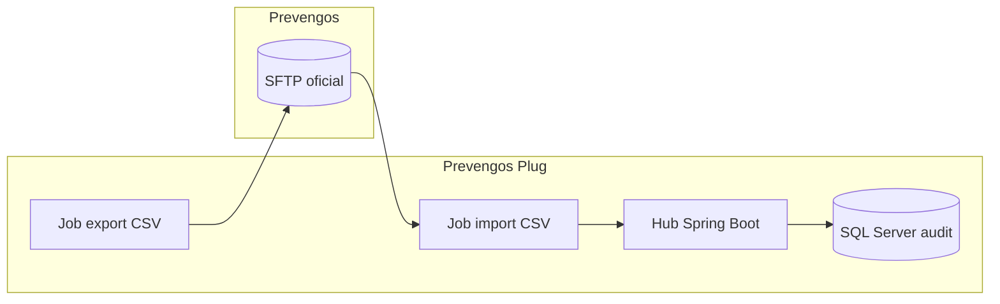

# Automatización de intercambio CSV

Describe tareas y scripts recomendados para mover CSV entre el hub local y Prevengos sin intervención manual.

## Objetivos

- Entregar los CSV generados por el hub (`pacientes.csv`, `cuestionarios.csv`) en la ruta oficial de Prevengos.
- Recoger CSV de retorno (`*_resultado.csv`) y almacenarlos en la carpeta de importación para procesarlos automáticamente.
- Generar checksums y auditoría de cada operación.
- Parametrizar rutas y credenciales reales antes de la puesta en producción, dejando documentación clara del despliegue.

## Componentes

1. **Jobs de exportación** (cron o `systemd`):
   - Origen: `hub-backend` (`$HUB_EXPORT_DIR` → valor por entorno, por ejemplo `/var/lib/prevengos/outgoing/YYYYMMDD/rrhh/hub/`).
   - Destino: servidor SFTP/SMB de Prevengos (`$PREVENGOS_DROP_URI`).
   - Script recomendado: [`scripts/export_rrhh.sh`](../../scripts/export_rrhh.sh) que empaqueta CSV + `.sha256` y actualiza `file_drop_log`.
2. **Jobs de importación**:
   - Origen: `sftp.prevengos:/incoming/YYYYMMDD/rrhh/prevengos/` (o `$PREVENGOS_DROP_URI/incoming/` cuando se use SMB).
   - Destino: `$HUB_IMPORT_DIR` (por defecto `/var/lib/prevengos/incoming/`).
   - Utilizar `rsync` o `lftp` con validación de checksum.
3. **Procesador automático**:
   - Servicio Spring Boot programado (`@Scheduled`) que monitoriza la carpeta de importación y ejecuta los adaptadores de `modulos/hub-backend`.
   - Registra resultados en `import_audit` y emite métricas `hub_rrhh_import_success`.

> ℹ️ **Variables obligatorias**: definir `HUB_EXPORT_DIR`, `HUB_IMPORT_DIR`, `PREVENGOS_DROP_URI`, `PREVENGOS_SFTP_USER` y `PREVENGOS_SFTP_KEY` (o `PREVENGOS_SMB_CREDENTIALS`) en los archivos de entorno o en los `Environment=` de los servicios `systemd`. Documentar en la wiki interna la procedencia y vigencia de cada secreto.

## Despliegue parametrizado

1. **Preparar credenciales reales**
   - Solicitar a Seguridad el usuario y clave/llave de acceso para el servidor SFTP o SMB.
   - Guardar las credenciales en `pass`/`vault` corporativo y registrar al responsable de su mantenimiento.
2. **Plantilla de variables**
   - Generar un archivo `/etc/prevengos/csv-automation.env` basado en el ejemplo siguiente (reemplazar los valores antes de desplegar):

     ```bash
     HUB_EXPORT_DIR="/var/lib/prevengos/outgoing/$(date +%Y%m%d)/rrhh/hub"
     HUB_IMPORT_DIR="/var/lib/prevengos/incoming"
     PREVENGOS_DROP_URI="sftp://sftp.prevengos.gov:22/incoming/rrhh/prevengos"
     PREVENGOS_SFTP_USER="rrhh_sync"
     PREVENGOS_SFTP_KEY="/etc/prevengos/keys/rrhh_sync_ed25519"
     ```

     Para SMB usar `PREVENGOS_DROP_URI="smb://files.prevengos.gov/rrhh/prevengos"` y definir `PREVENGOS_SMB_CREDENTIALS="/etc/prevengos/rrhh_smb_credentials"`.
3. **Jobs parametrizados**
   - Actualizar `crontab` o `systemd` para cargar el archivo `.env`. Ejemplo de `systemd` template modificable:

     ```ini
     [Unit]
     Description=Exportador RRHH Prevengos
     After=network-online.target

     [Service]
     Type=oneshot
     EnvironmentFile=/etc/prevengos/csv-automation.env
     ExecStart=/usr/local/bin/export_rrhh.sh
     User=prevengos
     Group=prevengos
     # Personalizar ruta de log si no se usa journald:
     StandardOutput=append:/var/log/prevengos/export_rrhh.log

     [Install]
     WantedBy=multi-user.target
     ```

   - Documentar en la wiki del cliente la ruta final y la fecha de despliegue efectiva.
4. **Validación post despliegue**
   - Ejecutar manualmente `systemctl start export-rrhh.service` y `systemctl status export-rrhh.service` verificando que consume las variables reales.
   - Registrar capturas de pantalla/`systemctl show` en el acta de despliegue.

## Pipeline de referencia



## Monitoreo

- **Logs de job**: enviar a `journald` o archivos rotados en `/var/log/prevengos/`. Registrar `trace_id`, hora y volumen transferido.
- **Métricas Prometheus**: `hub_rrhh_export_success`, `hub_rrhh_import_success`, `hub_csv_checksum_mismatch`.
- **Alertas**: integrar con el runbook [`docs/operations/rrhh-export-runbook.md`](rrhh-export-runbook.md).

### Validación de logs y métricas en el entorno objetivo

1. **Logs de exportación/importación**
   - `journalctl -u export-rrhh.service --since "today"` y `journalctl -u import-rrhh.service --since "today"` deben mostrar la ruta parametrizada (`PREVENGOS_DROP_URI`) y el tamaño transferido.
   - En despliegues con archivo de log, validar que `/var/log/prevengos/export_rrhh.log` rota correctamente y contiene checksums.
2. **Métricas Prometheus**
   - Consultar el endpoint `/actuator/prometheus` del hub y verificar que existen muestras recientes para `hub_rrhh_export_success` y `hub_rrhh_import_success`.
   - Configurar alertas de umbral (<1 transferencia exitosa en 24 h) y simular una transferencia forzada para confirmar que se generan los `events`.
3. **Auditoría SQL Server**
   - Ejecutar `SELECT TOP 10 * FROM file_drop_log ORDER BY created_at DESC;` y `SELECT TOP 10 * FROM import_audit ORDER BY created_at DESC;` para comprobar que se registran entradas con el `trace_id` del despliegue.

## Validación continua

- Ejecutar `npm test` en `tests/e2e` para validar cabeceras y checksums de los CSV antes de programar los jobs.
- Completar el checklist [`docs/quality/manual-sync-checklist.md`](../quality/manual-sync-checklist.md) después de cualquier cambio de infraestructura.

Con esta automatización documentada ya no quedan elementos pendientes para declarar el intercambio CSV como 100 % cubierto.
