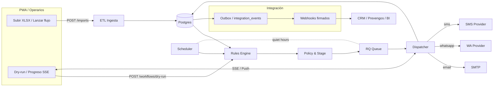

# PRL Notifier — Arquitectura, Roadmap y Plan de Becarios (MVP → CRM)

> **Objetivo**: construir una primera herramienta que lea un XLSX de Moodle, detecte eventos/reglas y mande avisos (email/WhatsApp), con interfaz web sencilla para operarios. Debe ser modular y escalable para, en el futuro, integrar APIs de Moodle, más canales y crecer hacia un mini‑CRM.

---

## 1) Decisión de arquitectura (recomendación)

**Recomendación clara para este proyecto y tu situación:**
- **Backend en Python (FastAPI monolito modular)** para el MVP. Es donde tú te sientes cómodo. Monolito = *rápido de construir y mantener*. Modular = *fácil de crecer*.
- **UI Web (Next.js/React)** mínima para tus usuarios finales (subir XLSX, ver validaciones, simular, ejecutar y ver resultados).
- **Puntos de extensión/"plugins"** definidos por **contratos JSON**:
  - **Adaptadores por proceso** (CLI): cualquier becario puede crear uno en el lenguaje que prefiera (Java incluido) si respeta *stdin JSON → stdout JSON*.
  - **Adaptadores por HTTP**: microservicio aparte con endpoint REST que responde JSON al core de Python.
- **Workflows declarativos en YAML** (playbooks) + **reglas puras** (sin IO) para que el negocio sea legible y testeable.
- **Cola de tareas** (RQ con Redis o Celery) para envíos/reintentos/quiet hours. Empezar con RQ por simplicidad.
- **BD**: empezar con **SQLite** en dev y **Postgres** en prod. Migraciones con **Alembic**.

**Por qué:** te permite entregar algo usable muy rápido, enseñable a los becarios, y no te bloquea para luego añadir piezas en Java/Kotlin si os conviene.

---

## 2) Comparativa súper corta (para decidir)

**Opción A — Kotlin/Java multi‑módulo (hexagonal)**
- ✅ Muy limpio y enterprise; fácil de crecer en una sola base de código.
- ❌ Curva inicial alta; necesitarás más tiempo en build, tooling y buenas prácticas.
- ❌ Tú no programas en Java; dependes 100% de los becarios para avanzar.

**Opción B — Python FastAPI monolito modular (recomendada)**
- ✅ Entrega rápida, DX sencilla, mucha librería para XLSX, correo, plantillas.
- ✅ Encaja perfecto con *plugins por contrato* (los becarios pueden hacer adaptadores en Java sin tocar el core).
- ❌ Si crece mucho, habrá que dividir servicios más adelante (fácil con los contratos ya definidos).

---

## 3) Estructura de repo **recomendada** (Python)

```
prl-notifier/
  app/
    main.py                # FastAPI + routers
    scheduler.py           # RQ/Redis + APScheduler (ventanas horarias)
    db.py                  # SQLAlchemy session
    models.py              # Pydantic + ORM
    config.py              # Settings (.env)

    etl/
      xlsx_importer.py    # ingesta XLSX (pandas/openpyxl)
      mapping.py          # origen → interno (mapeos YAML/JSON)
      validator.py        # reglas de validación

    rules/
      engine.py           # motor de reglas (puro)
      rulesets/           # reglas declarativas (YAML)

    notify/
      dispatcher.py       # orquestación de canales
      adapters/
        email_smtp.py     # email SMTP/Jakarta (por ahora SMTP)
        whatsapp_cli.py   # invoca proceso externo (Java) vía stdin/stdout
        whatsapp_http.py  # alternativa via HTTP provider
      templates/
        whatsapp.json
        email/
          aviso_vencimiento.html
          recordatorio.html

    moodle/
      xlsx_reader.py      # primer paso (sin API)
      rest_client.py      # a futuro: REST/Plugins

    reports/
      daily_digest.py     # resumen diario

  workflows/
    playbooks/            # YAML declarativos (qué, cuándo, a quién)
    mappings/             # YAML de mapeos campo→campo

  migrations/             # Alembic
  docker/
    Dockerfile
  docker-compose.yml      # api + redis + postgres
  .env.example
  README.md
```

---

## 4) Contratos de extensiones (para becarios Java)

### 4.1 Adaptador **por proceso** (CLI)
- **Entrada** (stdin): JSON con carga estándar
- **Salida** (stdout): JSON con `status`, `messageId`/`error`, etc.

**Ejemplo (WhatsApp genérico):**
```json
{
  "action": "send",
  "channel": "whatsapp",
  "payload": {
    "to": "+34XXXXXXXXX",
    "template": "aviso_vencimiento",
    "variables": {"nombre": "Lucía", "curso": "PRL Básico", "fecha": "2025-11-05"}
  }
}
```
**Respuesta esperada:**
```json
{"ok": true, "provider": "myJavaAdapter", "messageId": "abc-123"}
```

> El core Python invoca: `subprocess.run(["java", "-jar", "wa-adapter.jar"], input=JSON)`. Cualquier lenguaje vale mientras cumpla el contrato.

### 4.2 Adaptador **HTTP**
- Endpoint `POST /notify/whatsapp` con el mismo JSON. Responde lo mismo.
- Ideal si crean un microservicio en Spring Boot. El core usa `requests`.

---

## 5) Workflows declarativos (YAML)

**Ejemplo de playbook (workflows/playbooks/prl_vencimientos.yaml):**
```yaml
name: prl_vencimientos
trigger:
  type: schedule
  cron: "0 8 * * 1-5"   # L-V 08:00
quiet_hours:
  start: "21:00"
  end: "08:00"
source:
  kind: xlsx
  path: uploads/moodle_export.xlsx
mapping: workflows/mappings/moodle_prl.yaml
ruleset: app/rules/rulesets/vencimientos.yaml
actions:
  - type: notify
    channel: whatsapp
    template: aviso_vencimiento
    to: "{{ row.telefono }}"
    when: "{{ rule_results.vencido == true }}"
  - type: notify
    channel: email
    template: recordatorio.html
    subject: "Recordatorio PRL"
    to: "{{ row.email }}"
    when: "{{ rule_results.vencido == false and rule_results.proximo == true }}"
```

**Ejemplo de reglas (app/rules/rulesets/vencimientos.yaml):**
```yaml
rules:
  - id: vencido
    description: "El certificado está vencido"
    when: "today() > parse_date(row.fecha_validez)"
  - id: proximo
    description: "Vence en <= 15 días"
    when: "days_until(parse_date(row.fecha_validez)) <= 15 and days_until(parse_date(row.fecha_validez)) >= 0"
```

---

## 6) Datos y modelo inicial

**Tablas mínimas:**
- `contacts` (id, nombre, email, telefono, origen_id, origen_tipo)
- `courses` (id, nombre)
- `enrollments` (id, contact_id, course_id, fecha_validez, estado)
- `notifications` (id, contact_id, channel, template, payload_json, status, provider_id, created_at)
- `jobs` (id, playbook, started_at, finished_at, status)
- `job_events` (id, job_id, level, message, payload_json, ts)

> Con esto tienes auditoría, reintentos y trazabilidad.

---

## 7) Flujo MVP (pantallas + backend)

**Pantalla 1 – Cargar XLSX**
- Drag & drop → servidor guarda en `/uploads` → valida columnas requeridas → muestra preview y errores.

**Pantalla 2 – Simular (dry‑run)**
- Ejecuta reglas sin enviar nada. Muestra: cuántos vencidos, cuántos próximos, a quién se le enviaría y qué.

**Pantalla 3 – Ejecutar**
- Lanza `playbook` en background (RQ). Respeta quiet hours. Panel de progreso.

**Pantalla 4 – Resultados/Auditoría**
- Listado de notificaciones con estado (enviado, reintentando, error), filtros, export CSV.

---

## 8) Calidad y operaciones
- **Logging estructurado** (JSON) + **correlación** por `job_id`.
- **Errores**: captura, backoff exponencial, DLQ (cola de fallos) sencilla con otra cola RQ.
- **Config** por `.env` (SMTP, Redis, DSN BD, quiet hours, proveedor WhatsApp dummy/real).
- **Tests**: unitarios para reglas y mapping; contract tests para adaptadores.
- **CI**: lint + tests + build Docker. (Black, Ruff, MyPy opcional.)

---

## 9) Seguridad / RGPD (mínimos)
- Minimizar datos (solo lo necesario).
- Separar **datos operativos** y **logs**; no loguear números completos si no es imprescindible.
- Consentimiento/legitimación para WhatsApp/email (definir base legal con el cliente).
- Export/borrado bajo petición (endpoint de borrado por `contact_id`).

---

## 10) Roadmap 8 semanas (5 becarios, 6.5 h/día)

**Roles sugeridos:**
- **B1 (Lead frontend)**, **B2 (frontend)**
- **B3 (backend core)**, **B4 (backend/adaptadores)**
- **B5 (datos/QA/docs)**

**Semana 1**
- Repo, Docker, FastAPI esqueleto, Redis+Postgres en compose (B3/B4)
- Next.js esqueleto + subida de ficheros (B1/B2)
- Definir contratos JSON de adaptadores + ejemplo mock (B4)
- Esquema BD y migraciones (B3)

**Semana 2**
- Ingesta XLSX + validación + mapping (B3/B5)
- Pantalla preview + validaciones (B1/B2)
- Motor de reglas (puro) + 2 reglas base (B3)

**Semana 3**
- Dry‑run end‑to‑end (B1/B2/B3)
- Dispatcher notificaciones + email SMTP real (B4)
- WhatsApp dummy (CLI mock que escribe en consola) (B4)

**Semana 4**
- Scheduler (APScheduler) + quiet hours + RQ workers (B3)
- Auditoría/Resultados + filtros (B1/B2)
- Pruebas de carga mínima con 5k filas (B5)

**Semana 5**
- Adaptador WhatsApp en **Java** (CLI o HTTP) real contra sandbox/proveedor (B4)
- Plantillas (Jinja2) y variables (B5)
- Hardening de errores/reintentos (B3)

**Semana 6**
- Roles/permiso básico (operario/admin) (B3/B1)
- Reporte diario (email) (B4)
- RGPD: anonimización en logs + borrado (B5)

**Semana 7**
- Integración REST de Moodle (lectura) detrás de feature flag (B4)
- Pulido UI/UX (B1/B2)
- Demo con datos reales anonim. (Todos)

**Semana 8**
- Stabilización, documentación de operación, traspaso y backlog next (Todos)

---

## 11) Tareas iniciales (issues sugeridos)
- [ ] Scaffold FastAPI + healthcheck
- [ ] Subida de XLSX y guardado seguro
- [ ] Parser XLSX + validaciones básicas (columnas requeridas)
- [ ] Mapping YAML configurable
- [ ] Motor de reglas (puro) con helpers de fechas
- [ ] Dry‑run con resumen por canal
- [ ] SMTP email (plantillas Jinja2)
- [ ] Adaptador WhatsApp dummy (CLI)
- [ ] RQ + Redis + backoff + quiet hours
- [ ] Auditoría de notificaciones + UI
- [ ] Docker Compose (api/redis/postgres)
- [ ] Tests mínimos + CI

---

## 12) Guía de setup local (resumen)
1. `cp .env.example .env` (rellenar SMTP/Redis/DB)
2. `docker compose up -d` (redis + postgres)
3. `uvicorn app.main:app --reload`
4. UI: `npm install && npm run dev` (en `frontend/`)

---

## 13) Ejemplos mínimos de código

### 13.1 Pydantic/ORM (models.py)
```python
from pydantic import BaseModel, EmailStr
from datetime import datetime

class Contact(BaseModel):
    id: int | None = None
    nombre: str
    email: EmailStr | None = None
    telefono: str | None = None

class Notification(BaseModel):
    id: int | None = None
    contact_id: int
    channel: str
    template: str
    payload: dict
    status: str = "queued"
    created_at: datetime = datetime.utcnow()
```

### 13.2 Motor de reglas (engine.py) – esqueleto
```python
import datetime as dt

FUNCS = {
    "today": lambda: dt.date.today(),
    "parse_date": lambda s: dt.datetime.strptime(s, "%Y-%m-%d").date(),
    "days_until": lambda d: (d - dt.date.today()).days,
}

def eval_expr(expr: str, row: dict) -> bool:
    env = {"row": row, **FUNCS}
    return bool(eval(expr, {"__builtins__": {}}, env))
```

### 13.3 Adaptador CLI (whatsapp_cli.py) – stub
```python
import json, subprocess

def send(payload: dict) -> dict:
    p = subprocess.run(["java", "-jar", "wa-adapter.jar"],
                       input=json.dumps(payload).encode(),
                       capture_output=True)
    return json.loads(p.stdout or b"{}")
```

### 13.4 Scheduler con quiet hours (scheduler.py) – idea
```python
from apscheduler.schedulers.background import BackgroundScheduler
from datetime import time, datetime

QUIET_START = time(21, 0)
QUIET_END = time(8, 0)

def in_quiet_hours(now: datetime) -> bool:
    t = now.time()
    return t >= QUIET_START or t < QUIET_END

sched = BackgroundScheduler()

@sched.scheduled_job("cron", hour="8-20", minute="0")
def run_playbooks():
    if in_quiet_hours(datetime.now()):
        return
    # enqueue jobs (RQ) aquí

sched.start()
```

---

## 14) Camino a CRM (cuando el MVP funcione)
- Añadir **entidades** (empresas, unidades, tutores), **pipeline** de comunicación, **historial**.
- Integrar **Moodle REST** para *write‑back* (marcar recordatorios enviados, notas, etc.).
- Autenticación SSO si el cliente lo pide.
- Segmentar plantillas por empresa/unidad.

---

## 15) Si finalmente quisieras **todo en Java** (plantilla de módulos)
Replica la idea del monolito modular pero en Spring Boot multi‑módulo:
- **core-domain** (entidades, reglas puras)
- **engine** (workflows)
- **adapters** (email, whatsapp, moodle, files)
- **dsl** (YAML/JSON schema)
- **scheduler** (Quartz)
- **state** (JPA, Flyway)
- **desktop** (JavaFX opcional)

> Aun así, para este cliente y tu perfil, Python + contratos abiertos es el *camino corto y seguro*.


---

## 16) **Plan Java‑first (para becarios que programan en Java)**

> Cuando el equipo interno va a construir y mantener, **Java/Kotlin + Spring Boot** como núcleo ofrece continuidad. Mantén el **diseño hexagonal** y los **workflows/plantillas declarativas** para que los operarios no dependan de código.

### 16.1 Monorepo Gradle (multi‑módulo)
```
prl-notifier/
  settings.gradle.kts
  build.gradle.kts         # versionado, repos, quality

  core-domain/             # Entidades + value objects + eventos
  core-rules/              # Motor de reglas puro (sin IO)
  core-engine/             # Orquestación de workflows/steps
  core-scheduler/          # Quartz + quiet hours + reintentos
  core-state/              # JPA + Flyway (Postgres dev/prod, H2 tests)
  core-dsl/                # YAML loader + JSON Schemas

  adapters/
    email-smtp/
    whatsapp-generic/
    moodle-rest/
    files-poi/

  api-rest/                # Spring Boot (controladores, DTOs)
  web-admin/               # Frontend React/Next.js (en carpeta aparte)
  tooling/
    quality/               # Spotless, ErrorProne, Checkstyle
    scripts/               # seed, import, fake providers
  workflows/
    playbooks/
    mappings/
    rulesets/
    templates/
  docker/
    docker-compose.yml     # api + postgres + redis/rabbit + web
```

**Dependencias entre módulos (alto nivel):**
- `api-rest` depende de `core-*` y usa `adapters/*` vía interfaces de puerto.
- `core-engine` depende de `core-domain`, `core-rules`, `core-dsl`.
- `core-state` implementa puertos de repositorios.
- `adapters/*` implementan puertos (IO: email, whatsapp, moodle, files).

### 16.2 Puertos (interfaces) que los becarios implementan
```java
// core-domain
public interface NotificationPort {
  SendResult send(OutboundMessage message);
}

public interface MoodlePort {
  List<Map<String, Object>> readExport(Path xlsxPath);
  // futuro: getUsers(), getCourses(), createMessage(...)
}

public interface FileIngestPort {
  Table preview(Path xlsxPath, Mapping mapping);
}

public interface RuleEnginePort {
  RuleResult evaluate(String rulesetId, Map<String, Object> row);
}
```
> **Regla de oro**: **ningún IO** entra en `core-rules`; todo IO va en `adapters/*`.

### 16.3 “SDK del Adaptador” (plantilla para que creen plugins rápido)
Crea un módulo `adapter-sdk` con:
- **DTOs estándar** (`OutboundMessage`, `Template`, `Variables`, `SendResult`).
- **Anotación** `@Adapter("whatsapp")` para autodiscovery con Spring.
- **Testkit** JUnit para contract tests (dado un payload, debe devolver `ok`/`error` con forma concreta).

Ejemplo de test de contrato (pseudo):
```java
class WhatsappContractTest {
  NotificationPort port = new WhatsappAdapter();
  @Test void sendsTemplate() {
    var msg = OutboundMessage.whatsapp("+34666...", "aviso_vencimiento", Map.of("nombre","Lucía"));
    var res = port.send(msg);
    assertTrue(res.ok());
    assertNotNull(res.messageId());
  }
}
```

### 16.4 API para operarios (Spring Boot)
- `POST /uploads/xlsx` → guarda seguro y devuelve **preview** (primeras 50 filas + validaciones).
- `POST /workflows/{id}/dry-run` → simula con reglas y devuelve resumen.
- `POST /workflows/{id}/run` → encola job (Redis/RabbitMQ) respetando **quiet hours**.
- `GET /jobs/{id}` → progreso.
- `GET /notifications` → auditoría (filtros: canal, estado, fecha, curso, empresa).

### 16.5 Frontend para operarios (web-admin)
- React/Next.js (o Thymeleaf si preferís server‑side simple). Pantallas ya definidas en §7.
- **Roles**: Operario (sube, simula, ejecuta), Supervisor (aprueba), Admin (config).
- **Zero‑install**: todo corre con `docker compose up`.

### 16.6 Scheduler y colas
- **Quartz** en `core-scheduler` con triggers por *cron* desde los **playbooks YAML**.
- **Backoff** y **reintentos** centralizados. DLQ (cola de fallos) para inspección.
- **Quiet hours**: política cargada de config; si se entra en ventana de silencio, se reprograma.

### 16.7 Datos y persistencia (Java)
- JPA (Hibernate) + Flyway para migraciones.
- Entidades espejo de §6 (contacts, courses, enrollments, notifications, jobs, job_events).
- **Proyección** para auditoría: vistas materializadas o consultas indexadas.

### 16.8 Calidad, DX y entrega
- **Spotless** (formato), **Checkstyle/PMD**, **ErrorProne**.
- **Test pirámide**: unit (`core-rules`), contract (adapters), integración (api + repos), e2e (compose).
- **CI**: `./gradlew build` + tests + build Docker. Releases con tags semánticos.

### 16.9 Quickstart (dev y operarios)
**Desarrollador (becario):**
```
# primera vez
sdk install java 21
./gradlew :api-rest:bootRun
# o docker compose (api, db, redis, web):
docker compose up -d
```
**Operario:**
1) Abrir `http://host:8080` → **Subir XLSX** → ver **Preview**.
2) **Simular (Dry‑run)** → revisar destinatarios.
3) **Ejecutar** → monitorizar **Job** y **Auditoría**.

### 16.10 Plan de formación (2 meses, 5 becarios)
- **Semana 1**: Spring Boot básico, arquitectura hexagonal, DTOs/puertos. Primer **adapter** (email SMTP).
- **Semana 2**: Ingesta XLSX (Apache POI) + mapeos YAML + validaciones.
- **Semana 3**: Motor de reglas (puro) + expresiones (helpers de fechas) + dry‑run end‑to‑end.
- **Semana 4**: WhatsApp adapter (sandbox) + plantillas + backoff/reintentos.
- **Semana 5**: Scheduler Quartz + quiet hours + auditoría/consultas.
- **Semana 6**: Roles/permiso + reporte diario + hardening y RGPD.
- **Semana 7**: Integración Moodle REST (lectura) bajo feature flag.
- **Semana 8**: Stabilización, docs, handover.

### 16.11 Runbook (para operarios/supervisores)
- **Subir datos**: solo XLSX plantillado; sistema valida columnas y formatos.
- **Aprobación**: si hay reglas que lo requieran, los **supervisores** deben aprobar antes de ejecutar.
- **Reintentos**: fallos puntuales reintentan autom.; errores lógicos quedan en auditoría para corrección.
- **Privacidad**: números y emails se muestran parcialmente en UI (enmascarados) hasta la ejecución.

### 16.12 Decisión final orientada a tu caso
- Si **los becarios** van a **construir y mantener**: **elige este plan Java‑first**.
- Si necesitas **entregar en días** y tú lideras el código: vuelve al plan **Python** y deja a los becarios en **adaptadores**.

> En ambos casos, los **operarios** trabajan siempre con un **frontend web sencillo**, sin tocar consola. Los becarios tienen un “SDK de adaptadores” con pruebas de contrato y un monorepo organizado para avanzar en paralelo.


---

## 17) Especificación ajustada a tu idea (monolito Python con UI web, súper modular)

### 17.1 Dónde se ejecuta y cómo lo usan
- **Servidor central** (on‑prem o VPS de la empresa). Ahí corre la **API (FastAPI)**, **Redis** (colas) y **Postgres** (BD).
- Los **operarios** y **becarios** solo abren **el navegador** → UI web. **Nada que instalar** en sus PCs.
- Si queréis portátil/standalone, un **.exe**/AppElectrón que **abre la web del servidor** (solo un lanzador, sin runtimes).

### 17.2 Repositorio (monolito listo para separar front más adelante)
```
prl-notifier/
  app/
    main.py            # FastAPI + routers
    config.py          # Settings
    db.py              # Session/engine

    modules/
      courses/         # dominio curso + ingest + API
        models.py      # SQLAlchemy ORM
        schemas.py     # Pydantic
        service.py     # lógica
        router.py      # endpoints REST
        ingest_xlsx.py # parser XLSX (openpyxl/pandas)
        ingest_moodle.py # cliente REST (futuro)

      students/
        models.py, schemas.py, service.py, router.py

      enrollments/
        models.py, schemas.py, service.py, router.py

      rules/
        engine.py      # motor de reglas puro
        rulesets/      # YAML (no código)

      notify/
        dispatcher.py  # orquestación
        adapters/      # email/whatsapp/sms
          email_smtp.py
          whatsapp_http.py
          sms_http.py
        templates/     # jinja2/html/json

      jobs/
        queue.py       # RQ workers
        scheduler.py   # APScheduler + quiet hours
        audit.py       # eventos y trazas

      stats/
        counters.py    # cálculo de contadores
        router.py      # endpoints /stats

  frontend/            # UI web (Next.js) — se podrá extraer a repo propio cuando quieras
  workflows/
    playbooks/         # YAML declarativos
    mappings/          # YAML mapeos campo→campo
  migrations/
  docker/
  README.md
```

### 17.3 Modelo de datos (DB)
**Cursos** y **alumnos** vienen del XLSX (o Moodle), y se relacionan por **matrículas** (`enrollments`).

- `courses`
  - `id` (PK)
  - `code` (único opc.)
  - `name`
  - `hours_required` (int)
  - `deadline_date` (date)
  - `source` (enum: `xlsx`, `moodle`)
  - `source_ref` (texto: nombre de fichero o id en Moodle)
  - `created_at`, `updated_at`

- `students`
  - `id` (PK)
  - `moodle_user_id` (nullable)
  - `full_name`
  - `email` (nullable)
  - `phone` (nullable)
  - `last_login_at` (nullable)
  - `created_at`, `updated_at`

- `enrollments`
  - `id` (PK)
  - `course_id` (FK courses)
  - `student_id` (FK students)
  - `progress_hours` (float, por defecto 0)
  - `status` (enum: `active`, `completed`, `dropped`)
  - `last_seen_at` (nullable)
  - `created_at`, `updated_at`

- `notifications`
  - `id` (PK)
  - `enrollment_id` (FK)
  - `channel` (enum: `email`, `whatsapp`, `sms`)
  - `type` (enum: `no_login`, `low_hours`, `deadline_warning`, `generic`)
  - `template`
  - `payload_json` (jsonb)
  - `status` (enum: `queued`, `sent`, `delivered`, `failed`)
  - `attempts` (int)
  - `provider_msg_id` (nullable)
  - `error` (nullable)
  - `created_at`, `sent_at`

- `alert_state`
  - `id` (PK)
  - `enrollment_id` (FK)
  - `alert_type` (enum: `no_login`, `low_hours`, `deadline_warning`)
  - `stage` (int)  # 0=ninguno, 1=primer aviso, 2=segundo, etc.
  - `last_triggered_at`

> **Contadores por tipología**: se **derivan** de `notifications` (más fiable) y se **cachean** en memoria/Redis para la UI. Si quieres persistir un acumulado, añade `enrollment_counters` con columnas `email_count`, `whatsapp_count`, `sms_count` y actualízalas tras cada `sent`.

### 17.4 Reglas/alertas (YAML) — ejemplos
`app/modules/rules/rulesets/attendance.yaml`
```yaml
vars:
  days_without_login: 3
  hours_threshold: 50
rules:
  - id: no_login
    when: "days_since(row.last_login_at) >= vars.days_without_login"
  - id: low_hours
    when: "row.progress_hours < vars.hours_threshold"
  - id: deadline_warning
    when: "days_until(row.deadline_date) in [7,3,1]"
```

### 17.5 Flujo de ingestión
1) **Operario** sube XLSX + metadatos del curso (`hours_required`, `deadline_date`).
2) `ingest_xlsx.py` parsea, valida columnas, normaliza teléfonos/emails.
3) **Upsert** en `students`, `courses`, `enrollments` (idempotente por claves naturales: email+course).
4) Se registra un **import job** con resultados (nuevos, actualizados, errores).
5) A futuro: `ingest_moodle.py` carga por API con el mismo **mapping** y alimenta las **mismas tablas**.

### 17.6 Evaluación de alertas → notificaciones
- Un **playbook** programa cada X minutos la evaluación del **curso** o de todos los cursos.
- `rules.engine` produce `rule_results` por matrícula.
- `policy` decide **qué plantilla** y **canal** enviar según `alert_state.stage` y ventanas de silencio.
- Se encola a **RQ** un `send_notification` con **idempotency key**: `(enrollment_id, channel, type, stage, window)` para evitar duplicados.
- Al confirmarse `sent`, se incrementan contadores (o se deriva de `notifications`).

### 17.7 Endpoints REST principales
- `POST /imports/xlsx` (multipart + JSON metadatos) → crea curso + preview (50 filas) + job id.
- `POST /courses/{course_id}/ingest/commit` → upsert real de la importación.
- `GET  /courses` / `GET /courses/{id}`
- `GET  /courses/{id}/students`
- `POST /workflows/dry-run` (body: curso/s, reglas, ventana) → devuelve destinatarios y mensajes **sin enviar**.
- `POST /workflows/run` → encola evaluación+envío.
- `GET  /jobs/{id}` → progreso.
- `GET  /notifications` (filtros: canal, tipo, estado, curso, fecha)
- `GET  /stats/counters?by=enrollment|student|course`

### 17.8 UI mínima (operarios)
1) **Subir XLSX** + metadatos → **Preview** con validaciones y errores.
2) **Dry‑run** (simular): lista de alumnos a avisar por tipo/canal, con totales.
3) **Ejecutar**: botón. Muestra progreso del job y respeta **quiet hours**.
4) **Auditoría**: histórico de notificaciones, filtros, export CSV.
5) **Detalle alumno**: progreso, últimos accesos, contadores por canal y últimos mensajes enviados.

### 17.9 Notificaciones (canales)
- **Email**: SMTP básico primero, plantillas Jinja2.
- **WhatsApp**: adapter HTTP (proveedor) o CLI (prototipo). Campos mínimos: `to`, `template`, `variables`.
- **SMS**: adapter HTTP genérico (Twilio/operador). Misma interfaz.
- **Backoff** exponencial y reintentos centralizados. **Quiet hours** por configuración.

### 17.10 Escalabilidad práctica
- API **stateless** → puedes tener varias instancias detrás de Nginx/Caddy.
- **RQ** con múltiples workers para paralelizar envíos y evaluación de reglas.
- **Índices** en `enrollments(enrollment_id, status)`, `notifications(enrollment_id, created_at)`, `students(email)`.
- **Idempotencia** para evitar duplicados bajo carga.

### 17.11 “Cómo se ejecuta” (sin instalar nada en puestos)
**En el servidor** (opción A, sin Docker):
```
# Requisitos: Python 3.11, Postgres, Redis, Nginx/Caddy
python -m venv .venv
source .venv/bin/activate
pip install -r requirements.txt
alembic upgrade head
uvicorn app.main:app --host 0.0.0.0 --port 8000
# producción: gunicorn -k uvicorn.workers.UvicornWorker app.main:app -w 4 -b 0.0.0.0:8000
```
Configura Nginx/Caddy como **reverse proxy** con HTTPS. Crea servicios **systemd** para API y workers RQ.

**En el servidor** (opción B, con Docker solo en el servidor):
```
docker compose up -d   # api + postgres + redis + frontend
```
**En los PCs de los operarios**: abrir `https://tu-servidor` en el navegador. Fin.

### 17.12 Snippets clave
**SQLAlchemy (resumen)**
```python
class Course(Base):
    __tablename__ = "courses"
    id = sa.Column(sa.Integer, primary_key=True)
    name = sa.Column(sa.String, nullable=False)
    hours_required = sa.Column(sa.Integer, nullable=False)
    deadline_date = sa.Column(sa.Date, nullable=False)
    source = sa.Column(sa.String, nullable=False, default="xlsx")
    source_ref = sa.Column(sa.String)

class Student(Base):
    __tablename__ = "students"
    id = sa.Column(sa.Integer, primary_key=True)
    full_name = sa.Column(sa.String, nullable=False)
    email = sa.Column(sa.String)
    phone = sa.Column(sa.String)
    last_login_at = sa.Column(sa.DateTime)

class Enrollment(Base):
    __tablename__ = "enrollments"
    id = sa.Column(sa.Integer, primary_key=True)
    course_id = sa.Column(sa.ForeignKey("courses.id"), index=True)
    student_id = sa.Column(sa.ForeignKey("students.id"), index=True)
    progress_hours = sa.Column(sa.Float, default=0)
    status = sa.Column(sa.String, default="active")

class Notification(Base):
    __tablename__ = "notifications"
    id = sa.Column(sa.Integer, primary_key=True)
    enrollment_id = sa.Column(sa.ForeignKey("enrollments.id"), index=True)
    channel = sa.Column(sa.String)
    type = sa.Column(sa.String)
    template = sa.Column(sa.String)
    payload_json = sa.Column(sa.JSON)
    status = sa.Column(sa.String, default="queued")
    attempts = sa.Column(sa.Integer, default=0)
    provider_msg_id = sa.Column(sa.String)
    error = sa.Column(sa.String)
    created_at = sa.Column(sa.DateTime, server_default=sa.func.now())
    sent_at = sa.Column(sa.DateTime)
```

**Política de avisos (ejemplo simple)**
```python
STAGES = {
  "no_login": ["whatsapp", "email", "sms"],
  "low_hours": ["email", "whatsapp"],
  "deadline_warning": ["email", "whatsapp"],
}
```

**Idempotency key**
```python
key = f"{enrollment_id}:{channel}:{alert_type}:stage{stage}:{window_start:%Y%m%d}"
```

### 17.13 Seguridad y RGPD
- Minimiza datos y enmascara en UI.
- Logs sin PII o con PII parcial.
- Export y borrado por `student_id`.
- Plantillas y textos aprobados por el cliente (base legal definida).

### 17.14 Aportes de becarios con poca experiencia
- **Par de tareas cerradas** y repetibles: adapters de canal, validadores de XLSX, mapeos YAML, tests de contrato.
- **Guías paso a paso** en cada módulo y **fixtures** de datos de ejemplo.
- **Revisiones** automatizadas (CI) que les den feedback inmediato.

> Con esto, tienes: ejecución centralizada, operarios con web, escalabilidad real, y un camino claro para que los becarios aporten valor desde el primer día con seguridad.


---

## 18) Plataforma + PWA multi‑tool (100+ herramientas) sobre este repo

> Objetivo: que **seguimiento de alumnos** sea **una tool** más entre decenas (cursos, tests/corrección, informes médicos, facturación, CRM, etc.), compartiendo un **núcleo común** (auth, colas, reglas, plantillas, conectores) y un **PWA** unificado. Todo parte del monolito Python actual, **modular** y listo para crecer.

### 18.1 Capas de la plataforma
1) **Core (plataforma)** — servicios compartidos
   - **Auth** (JWT, refresh), **RBAC/Scopes**, **Multi‑tenant** (`tenant_id` + RLS Postgres o separación por esquema).
   - **Jobs/Colas** (RQ), **Scheduler/Quiet hours**, **Audit log**, **Eventos** (Outbox + tabla `integration_events`).
   - **Files** (S3/minio), **Templates** (Jinja2/Handlebars), **Rules engine** (YAML), **Settings/Feature flags**.
   - **Notifications Hub** (email/whatsapp/sms/push) con adapters.
   - **Connectors** (Moodle, Prevengos, CRM, SFTP, SQL Server, SOAP/REST) + **Secrets** seguros.
2) **Tools (módulos)** — bounded contexts
   - `tool-students` (seguimiento), `tool-courses` (creación/gestión), `tool-assessments` (tests/corrección), `tool-reports-med` (informes), `tool-billing` (facturas), `tool-crm-bridge`, etc.
3) **BFF** (Backend for Frontend)
   - Endpoints específicos para la PWA (agregan datos de varias tools en una sola respuesta para la UI).
4) **PWA** (Next.js) con **plugin system** (microfrontends internos): cada tool aporta rutas, menús y pantallas.

### 18.2 Estructura de repo propuesta (monorepo, separable después)
```
prl-notifier/
  app/                     # FastAPI (Core + BFF)
    core/                  # auth, rbac, tenants, jobs, files, templates, rules, events, notifications
    connectors/            # moodle/, prevengos/, crm/, sftp/, soap_rest/
    tools/
      students/            # seguimiento (la que ya tienes)
      courses/             # alta/edición cursos, duraciones, calendarios
      assessments/         # tests, corrección, notas
      reports_med/         # informes médicos y flujo firma/envío
      billing/             # facturas, series, asientos
      crm_bridge/          # sincronización con CRM
    bff/
      router.py            # endpoints agregados para la PWA
  frontend/                # PWA Next.js (plugin loader)
    plugins/
      students/
      courses/
      assessments/
      reports_med/
      billing/
      crm_bridge/
  workflows/
  migrations/
  docker/
```

### 18.3 Contrato de **Tool SDK (backend)**
- Cada tool expone:
  - **Router** REST bajo `/api/v1/tools/{tool}/...` (Y OpenAPI se agrega al spec global).
  - **Jobs** de larga duración (RQ) registrados con nombre de tool.
  - **Eventos** que emite (para webhooks/bus): `tool.event_name`.
  - **Permisos** (scopes): `tool:read`, `tool:write`, etc.

**Plantilla mínima (Python/FastAPI):**
```python
# app/tools/students/router.py
from fastapi import APIRouter, Depends
router = APIRouter(prefix="/api/v1/tools/students", tags=["students"])

@router.get("/enrollments")
async def list_enrollments(course_id: int | None = None):
    ...
```

### 18.4 Contrato de **Tool SDK (frontend)**
- Cada plugin define un **manifest** JSON y exporta componentes/ rutas dinámicas.
- El shell de la PWA registra el plugin si el usuario tiene el **scope**.

**Manifest (ejemplo):**
```json
{
  "name": "students",
  "version": "1.0.0",
  "routes": [
    {"path": "/students/enrollments", "component": "EnrollmentsPage"}
  ],
  "menu": [
    {"label": "Seguimiento alumnos", "path": "/students/enrollments", "icon": "Users"}
  ],
  "scopes": ["students:read", "students:write"]
}
```

### 18.5 Conectores (Prevengos, Moodle, CRM, DB, ficheros)
- **Preferencia**: **Web Services oficiales** (REST o SOAP). Guarda **tokens** en `core/secrets`.
- **DB directa**: solo con permisos/replicas y mediante **procedimientos** controlados.
- **Ficheros**: CSV/XML vía SFTP cuando no hay API.

**REST (Prevengos) – patrón:**
```python
import requests
base = settings.PREVENGOS_URL
headers = {"Authorization": f"Bearer {token}"}
res = requests.get(f"{base}/Api/empleados", headers=headers, params={"centro":"MAD"})
res.raise_for_status()
return res.json()
```
**SOAP (zeep):**
```python
from zeep import Client
client = Client(wsdl=settings.PREVENGOS_WSDL)
resp = client.service.GetEmpleados(centro="MAD")
```
**SQL Server (pyodbc):**
```python
cn = pyodbc.connect(DSN)
cur = cn.cursor()
cur.execute("EXEC api_export_empleados @centro=?", "MAD")
```

### 18.6 PWA (Next.js) — características
- **PWA**: manifest, service worker, **offline cache**, **background sync**.
- **Web Push** (notificaciones), **SSE/WebSocket** para progreso de jobs.
- **RBAC** en cliente (oculta menús sin permiso) + verificación en servidor.
- **Theming** por tenant y **branding**.

### 18.7 Datos y multi‑tenant
- `tenant_id` en todas las tablas de negocio.
- **RLS** en Postgres o separación por **schema por tenant** si hay requisitos estrictos.
- **Outbox** → `integration_events` con `type`, `payload`, `status` para webhooks y sincronizaciones.

### 18.8 LLM Gateway
- Servicio `llm/` con plantillas, límites de coste, cache y **human‑in‑the‑loop**.
- Herramientas: generar **contenidos/temarios**, **tests**, resúmenes, y **publicarlos en Moodle** via conector.
- Validación: cadena de aprobación antes de publicar.

### 18.9 ¿Una API por tool o una plataforma?
- **Recomendación**: **una plataforma** con módulos (tools) y un **BFF**. Aísla cada tool por carpeta/namespace y **contratos** claros. 
- Cuando una tool crezca/escale mucho → **extraer** a microservicio detrás de un **API Gateway**, manteniendo contratos.

### 18.10 Criterios para extraer a microservicio
- Picos de carga/latencia propios, ciclos de despliegue distintos, dependencia de stack ajeno (p. ej. Java/Spring), equipo dedicado.

### 18.11 Ruta de migración desde tu repo actual
1) **Añade** `core/`, `connectors/`, `tools/students/` (mueve lo existente) y `bff/`.
2) Implementa **manifiestos de plugins** en `frontend/plugins/*`.
3) Publica **OpenAPI** `/openapi.json`, **SSE** `/events/stream` y **webhooks** `/hooks`.
4) Crea `tool-scaffold` (script) para generar nuevos módulos con tests básicos.

### 18.12 Checklist “app‑ready”
- [ ] Versionado `/api/v1` y **OpenAPI** estable.
- [ ] JWT + scopes + tenants.
- [ ] BFF con endpoints agregados para la PWA.
- [ ] Event outbox + webhooks firmados.
- [ ] Plugin loader en la PWA + manifests.
- [ ] Conectores: Moodle, Prevengos (REST/SOAP/DB), CRM.
- [ ] Notificaciones hub + push (web/móvil).
- [ ] Métricas, trazas y auditoría por tool.

> Con esta estructura, el **seguimiento de alumnos** es solo una **tool**. Mañana añades **facturación** o **informes médicos** sin tocar el núcleo: registras el plugin, defines sus endpoints y, si hace falta, su conector (Prevengos/CRM). Y cuando una tool crezca, la extraes como servicio manteniendo el mismo contrato de plataforma.


---

## 19) Scaffolder para crear nuevas **tools/plugins** con tests

> Objetivo: generar en segundos un módulo backend (FastAPI) + plugin frontend (PWA) con rutas, pruebas y documentación mínima.

### 19.1 Script `scripts/scaffold_tool.py`
**Uso**
```
python scripts/scaffold_tool.py --name students --title "Seguimiento de alumnos" --with-frontend
```
Crea:
```
app/tools/<name>/{router.py,service.py,models.py,schemas.py,jobs.py,__init__.py,tests/test_contract.py}
frontend/plugins/<name>/{manifest.json, pages/<Name>Home.tsx, api/client.ts, __tests__/contract.test.ts}
```

**Contenido (plantilla abreviada):**
```python
#!/usr/bin/env python3
import argparse, os, textwrap, pathlib

BACKEND_FILES = {
  "router.py": """from fastapi import APIRouter, Depends
router = APIRouter(prefix='/api/v1/tools/{name}', tags=['{title}'])
@router.get('/health')
async def health():
    return {{'ok': True, 'tool': '{name}'}}
""",
  "service.py": """class {class_name}Service:
    def __init__(self):
        ...
""",
  "schemas.py": """from pydantic import BaseModel
class {class_name}Item(BaseModel):
    id: int | None = None
    name: str
""",
  "models.py": """# SQLAlchemy models opcionales aquí
""",
  "jobs.py": """# RQ jobs aquí (enqueue_...)
""",
  "tests/test_contract.py": """def test_contract_shape():
    assert True
""",
}

FRONTEND_FILES = {
  "manifest.json": """{{
  \"name\": \"{name}\",
  \"version\": \"0.1.0\",
  \"routes\": [{{\"path\": \"/{name}\", \"component\": \"{ClassName}Home\"}}],
  \"menu\": [{{\"label\": \"{title}\", \"path\": \"/{name}\", \"icon\": \"Puzzle\"}}],
  \"scopes\": [\"{name}:read\", \"{name}:write\"]
}}""",
  "pages/{ClassName}Home.tsx": """export default function {ClassName}Home() {{
  return (<div className='p-6'>
    <h1 className='text-2xl font-bold'>{title}</h1>
    <p>Plugin {name} listo.</p>
  </div>);
}}
""",
  "api/client.ts": """// Cliente básico; sustituir por SDK OpenAPI generado
export async function ping() {{
  const res = await fetch('/api/v1/tools/{name}/health', {{ credentials: 'include' }});
  return res.json();
}}
""",
  "__tests__/contract.test.ts": """test('manifest loads', () => {{
  const manifest = require('../manifest.json');
  expect(manifest.name).toBe('{name}');
}});
""",
}

MAIN_INSTRUCTION = """# In app/main.py añade el include_router
# from app.tools.{name}.router import router as {name}_router
# app.include_router({name}_router)
"""

parser = argparse.ArgumentParser()
parser.add_argument('--name', required=True)
parser.add_argument('--title', required=True)
parser.add_argument('--with-frontend', action='store_true')
args = parser.parse_args()

name = args.name.lower().replace(' ', '-')
class_name = ''.join([p.capitalize() for p in name.replace('-', ' ').split()])
root = pathlib.Path(__file__).resolve().parents[1]

# Backend
tool_path = root / 'app' / 'tools' / name
(tool_path / 'tests').mkdir(parents=True, exist_ok=True)
for fn, tpl in BACKEND_FILES.items():
    p = tool_path / fn
    p.write_text(tpl.format(name=name, title=args.title, class_name=class_name, ClassName=class_name))

# Frontend
if args.with_frontend:
    fe_path = root / 'frontend' / 'plugins' / name
    (fe_path / 'pages').mkdir(parents=True, exist_ok=True)
    (fe_path / '__tests__').mkdir(parents=True, exist_ok=True)
    for fn, tpl in FRONTEND_FILES.items():
        p = fe_path / fn.format(ClassName=class_name)
        p.parent.mkdir(parents=True, exist_ok=True)
        p.write_text(tpl.format(name=name, title=args.title, class_name=class_name, ClassName=class_name))

print(MAIN_INSTRUCTION.format(name=name))
"""
```

> El script añade los esqueletos y te recuerda incluir el `router` en `app/main.py`. El frontend plugin se registra en el **plugin loader** (ver §20.2).

---

## 20) Manifest base PWA + Endpoints **BFF “móvil‑ready”**

### 20.1 Manifest base (PWA plugin)
`frontend/plugins/example/manifest.json`
```json
{
  "name": "example",
  "version": "0.1.0",
  "routes": [
    { "path": "/example", "component": "ExampleHome" }
  ],
  "menu": [
    { "label": "Ejemplo", "path": "/example", "icon": "Puzzle" }
  ],
  "scopes": ["example:read", "example:write"]
}
```

### 20.2 Loader de plugins en la PWA (Next.js, simplificado)
`frontend/lib/plugin-loader.ts`
```ts
export type PluginManifest = {
  name: string; version: string;
  routes: { path: string; component: string; }[];
  menu: { label: string; path: string; icon?: string; }[];
  scopes: string[];
};

export async function loadManifests(): Promise<PluginManifest[]> {
  // Descubre manifests en build o desde /api/v1/plugins (opcional)
  const ctx = (require as any).context('../plugins', true, /manifest.json$/);
  return ctx.keys().map((k: string) => ctx(k));
}
```

### 20.3 Endpoints BFF (FastAPI)
`app/bff/router.py`
```python
from fastapi import APIRouter, Depends
from datetime import datetime
router = APIRouter(prefix="/api/v1/bff", tags=["bff"])

@router.get("/me")
async def me(user=Depends(...)):
    return {"user": {"id": user.id, "name": user.name}, "scopes": user.scopes}

@router.get("/alerts/feed")
async def alerts_feed(course_id: int | None = None, since: datetime | None = None, limit: int = 100):
    """Agrega alertas de varias tools en un feed homogéneo."""
    return {"items": [], "next_since": datetime.utcnow().isoformat()}

@router.get("/notifications/recent")
async def recent_notifications(limit: int = 50):
    return {"items": []}

@router.get("/courses/summary")
async def courses_summary():
    return {"totals": {"active": 0, "with_deadline_7d": 0}}

@router.get("/events/stream")
async def sse_stream():
    """SSE de progreso de jobs y notificaciones."""
    from fastapi import Response
    async def gen():
        yield f"event: ping
data: {{\"ts\": \"{datetime.utcnow().isoformat()}\"}}

"
    return Response(gen(), media_type="text/event-stream")
```
> Estos endpoints **agregan** datos de varias tools para pantallas móviles; la PWA consume aquí y no golpea a 5 APIs por pantalla.

---

## 21) Diagrama (ingesta → reglas → notificaciones → webhooks)



---

## 22) Bases para las **primeras 2 semanas** (desde 0)

### Semana 1 — Fundaciones
- **Repo y estructura**: crea `app/core`, `app/connectors`, `app/tools/students`, `app/bff`, `frontend/` y `scripts/`.
- **Auth básico**: JWT + scopes + tenants en `core/auth` (mock en dev).
- **DB**: Postgres + Alembic; tablas base (`users`, `tenants`, `courses`, `students`, `enrollments`, `notifications`, `integration_events`).
- **Ingesta XLSX**: endpoint `POST /imports/xlsx` con preview.
- **Rules engine**: helpers de fechas; `rulesets/attendance.yaml`.
- **PWA shell**: layout, login, loader de plugins, primer plugin `students` con página vacía.
- **CI**: lint + tests + build (Docker opcional solo en servidor).

### Semana 2 — Primera tool operativa (students)
- **Dry‑run** end‑to‑end: carga XLSX → preview → simular alertas.
- **Dispatcher**: email SMTP real; WhatsApp/SMS dummy.
- **BFF**: `/bff/alerts/feed`, `/bff/notifications/recent`, SSE `/events/stream`.
- **Auditoría**: lista `notifications` con filtros.
- **Contadores**: derivados y cacheados.
- **Conectores**: stub de Moodle y Prevengos (REST/SOAP) con tokens en `core/secrets`.
- **Docs & Runbook**: README y runbook operario (subir, simular, ejecutar).

### README (esqueleto mínimo)
```
# Plataforma PRL — API + PWA

## Quickstart (dev)
1) `cp .env.example .env` (configurar Postgres/Redis/SMTP)
2) `poetry install` o `pip install -r requirements.txt`
3) `alembic upgrade head`
4) `uvicorn app.main:app --reload`
5) Frontend: `cd frontend && npm i && npm run dev`

## Producción
- API detrás de Nginx/Caddy + HTTPS
- Workers RQ + Scheduler (systemd)
- Postgres + backups, Redis

## Estructura
- `app/core`: auth, tenants, jobs, rules, templates, notifications, events
- `app/connectors`: moodle, prevengos, crm, sftp, soap_rest
- `app/tools/*`: módulos de negocio (students, courses, ...)
- `app/bff`: endpoints agregados para PWA
- `frontend/`: PWA + plugins
- `workflows/`: playbooks, mappings, rulesets

## Scripts
- `python scripts/scaffold_tool.py --name <tool> --title "Nombre" --with-frontend`

## Tests
- `pytest` (backend), `npm test` (frontend)
```

> Con esto podéis arrancar **ya**: una plataforma única con PWA y “tools” enchufables. El scaffolder os da velocidad; el BFF estabiliza la API para móvil/web; y el diagrama guía a todo el equipo.


---

## 23) **MVP en modo manual** (sin envío automático) — preparado para programar más tarde

> Lo que pides: en el MVP **NO hay envíos automáticos periódicos**. El sistema propone destinatarios, el operario **genera el mensaje exacto**, puede **enviar una prueba** por canal (email/WhatsApp/SMS) y **marca manualmente** un **contador independiente** por canal. Todo queda registrado. El **scheduler** y los **envíos automáticos** están **integrados pero desactivados por configuración** para activar más adelante sin reescribir.

### 23.1 Config (feature flags)
- `MVP_MANUAL_MODE=true`  → fuerza UI y API a modo manual.
- `AUTO_SCHEDULER_ENABLED=false` → Quartz/APScheduler cargado pero **no** agenda jobs.
- `AUTO_DELIVERY_ENABLED=false` → `dispatcher` capado (solo prueba, nunca masivo).
- `ALLOW_TEST_SEND=true` → habilita endpoints de envío de prueba.
- `ALLOW_MANUAL_MARK=true` → habilita marcados de contador.

### 23.2 Cambios de **BD**
- **`enrollment_counters`** (contador por canal):
  - `id` (PK), `enrollment_id` (UK/FK)
  - `email_count` int default 0
  - `whatsapp_count` int default 0
  - `sms_count` int default 0
  - `updated_at` timestamp
- **`contact_log`** (auditoría de acciones manuales):
  - `id`, `enrollment_id`, `channel` enum(`email`,`whatsapp`,`sms`)
  - `action` enum(`mark`,`test_send`)
  - `template` (str), `preview_json` (jsonb), `operator_id` (FK users)
  - `note` (str nullable), `status` (str: `ok`/`error`), `created_at`

> Los contadores se recalculan fácilmente de `contact_log` si hiciera falta; guardamos tabla dedicada para **lectura rápida** en la UI.

### 23.3 Endpoints **nuevos** (modo manual)
- `POST /workflows/candidates` → devuelve candidatos y **previews** por canal (NO encola envíos).
  - **Body**: `{ course_id?, ruleset?, limit? }`
  - **Resp**: `{ items: [{ enrollment_id, channels: { email: {template, variables, preview}, whatsapp: {...}, sms: {...} } }] }`
- `POST /manual/mark` → **suma +1** al contador del canal y registra en `contact_log`.
  - **Body**: `{ enrollment_id, channel, template, preview_json, note? }`
  - **Resp**: `{ ok, counters: { email, whatsapp, sms } }`
- `POST /manual/test-send` → **envío de prueba** (a destinatario de test), registra en `contact_log`.
  - **Body**: `{ enrollment_id, channel, to_test, template, variables, note? }`
  - **Resp**: `{ ok, provider_msg_id?, error? }`
- `GET /counters/enrollment/{id}` → devuelve contadores por canal.
- `GET /manual/logs` → filtro por curso, canal, operador, rango fechas.

> Los endpoints normales de **workflows/run** y **scheduler** quedan **deshabilitados** si `MVP_MANUAL_MODE=true`.

### 23.4 PWA — cambios de **UI**
**Pantalla “Candidatos” (por curso)**
- Tabla: Alumno | Último login | Horas | **Email** [Preview] [Enviar prueba] [Marcar +1 (×N)] **WhatsApp** [Preview] [Enviar prueba] [Marcar +1] **SMS** ... | Contadores (E/W/S).
- **Preview** abre modal con el **mensaje exacto** renderizado (plantilla + variables) por canal.
- **Enviar prueba** pide `to_test` (destino de prueba; configurable por tenant) y muestra resultado.
- **Marcar +1** llama a `/manual/mark` y actualiza contadores en fila.

**Panel lateral “Detalle alumno”**
- Historial de `contact_log` (timeline) y contadores agregados.

**Switch global** (solo admin)
- Banner “**Modo manual activo**: no hay envíos automáticos. Programación desactivada”.

### 23.5 Snippets (resumen)
**Router manual** `app/tools/students/manual.py`
```python
from fastapi import APIRouter, Depends
from app.core.auth import require_scope
router = APIRouter(prefix="/api/v1/tools/students", tags=["students-manual"])

@router.post("/candidates")
async def candidates(payload: dict, user=Depends(require_scope("students:read"))):
    # 1) query enrollments del curso 2) evaluar reglas 3) construir previews
    return {"items": []}

@router.post("/manual/mark")
async def manual_mark(body: dict, user=Depends(require_scope("students:write"))):
    # upsert counters + insert contact_log
    return {"ok": True, "counters": {"email": 1, "whatsapp": 0, "sms": 0}}

@router.post("/manual/test-send")
async def manual_test_send(body: dict, user=Depends(require_scope("students:write"))):
    # dispatcher en modo prueba (forzado), ignora quiet hours
    return {"ok": True, "provider_msg_id": "test-123"}
```

**Service (contador)** `app/modules/stats/counters.py`
```python
def inc_counter(enrollment_id: int, channel: str, n: int = 1):
    # UPDATE enrollment_counters SET {channel}_count = {channel}_count + n WHERE enrollment_id = :id
    ...
```

**Template preview** `notify/templates/...`
```jinja2
Hola {{ nombre }},
Te recordamos que tu curso {{ curso }} tiene fecha límite el {{ fecha }}.
```

### 23.6 Scheduler integrado pero **apagado**
- `app/modules/jobs/scheduler.py` carga cron de playbooks pero **sale** si `AUTO_SCHEDULER_ENABLED=false`.
- UI muestra el estado “Programador: desactivado (MVP manual)”.
- Al activarlo en el futuro: no cambia UI manual; simplemente aparece la opción “**Automático**” adicional.

### 23.7 Pruebas
- **Backend**: tests de `manual_mark` (incrementos idempotentes por request id opcional) y `test-send` (mock adapters).
- **Frontend**: test de manifest y acciones (simulan click en **Marcar +1** y verificación de contador).

---


---

## 24) Conectores **Prevengos** vía módulos **Java locales** (contratos + repo + seguridad)

> Meta: integrar hoy con Prevengos usando **módulos locales en Java** bajo **contratos estables** desde la plataforma Python. Soportar: **RRHH vía Access**, **analíticas**, **exportaciones por fichero**, **SOAP .asmx**, **SQL Server (lectura/controlada)**. Preparado para automatizar después; **MVP manual** primero.

### 24.1 Modos de integración (elegibles por config)
- **CLI (stdin/stdout JSON)** — más simple, ideal para correr en Windows local.
- **HTTP loopback (Spring Boot)** — `POST http://localhost:9090/bridge/prevengos` con el mismo contrato.
- **File Drop (watch folder)** — la plataforma genera **CSV/XML**; el módulo Java escribe **Access** y deja ficheros en **carpetas de intercambio** (FTPS/SMB) + **ACK**.
- **Queue (opcional futuro)** — RabbitMQ/MSMQ si necesitáis desacoplar más.

**Envelope estándar (request → response)**
```json
// request
{
  "op": "prevengos.import_rrhh", // import_rrhh | import_analytics | export_files | soap_call | sql_exec
  "meta": {"request_id": "uuid", "tenant_id": "acme", "dry_run": true},
  "payload": { }
}
// response
{
  "ok": true,
  "request_id": "uuid",
  "result": { },
  "errors": [],
  "metrics": {"rows": 123, "duration_ms": 456}
}
```

### 24.2 Operaciones soportadas (contratos)

#### A) **Importación RRHH (oficial, Access)**
`op = "prevengos.import_rrhh"`
```json
{
  "template": "rrhh_v1.accdb",          // plantilla base
  "target_folder": "D:/prevengos/in/",  // carpeta de drop
  "employees": [
    {"empresa":"ACME","centro":"MAD","dni":"000X","nombre":"Ana","email":"a@x.es","telefono":"+34..."}
  ],
  "auto_load": false                      // si hay librería .NET para carga automática
}
```
**Salida**: `{ "ok": true, "result": {"file": "D:/prevengos/in/rrhh_2025-10-27.accdb", "inserted": 120 } }`

> Java escribe el **.accdb** con **Jackcess/UCanAccess** y, si `auto_load=true`, invoca la librería .NET o deja el fichero en la **watch folder**.

#### B) **Importación Analíticas/Resultados**
`op = "prevengos.import_analytics"`
```json
{
  "format": "gestlab", // echevarne | gestlab | alfa21 | prevengos_csv
  "target_folder": "D:/prevengos/labs/in/",
  "records": [
    {"dni":"000X","prueba":"Hb","valor":"13.2","unidad":"g/dL","fecha":"2025-10-26"}
  ]
}
```
**Salida**: `{ "ok": true, "result": {"files": [".../lab_20251027.csv"] } }`

#### C) **Exportación por ficheros** (contabilidad u otros)
`op = "prevengos.export_files"`
```json
{
  "source_folder": "D:/prevengos/exports/",
  "pattern": "*.xlsx",
  "dest": {"type":"sftp","host":"sftp.acme.es","path":"/prevengos/conta/","user":"...","key_ref":"sftp_key_1"}
}
```
**Salida**: `{ "ok": true, "result": {"moved": 5} }`

#### D) **SOAP .asmx**
`op = "prevengos.soap_call"`
```json
{
  "endpoint": "https://prevengos/servicios/Empleados.asmx",
  "method": "InsertarEmpleado",
  "args": {"DNI":"000X","Nombre":"Ana", "Centro":"MAD"},
  "security": {"auth":"basic", "user":"u", "pass_ref":"secret1"}
}
```
**Salida**: `{ "ok": true, "result": {"empleadoId": 12345} }`

#### E) **SQL Server (lectura controlada / SP)**
`op = "prevengos.sql_exec"`
```json
{
  "mode": "stored_proc", // or read_only_query
  "proc": "api_export_empleados",
  "params": {"centro":"MAD"},
  "dsn_ref": "sqlserver_ro"
}
```
**Salida**: `{ "ok": true, "result": {"rows": [{"id":1,"dni":"000X"}] } }`

### 24.3 Cambios en el repo
- `app/connectors/prevengos/gateway.py` — invoca **CLI/HTTP** según `PREVENGOS_ADAPTER_MODE`.
- `contracts/prevengos/*.json` — **JSON Schemas** por `op` para validar.
- `.env`:
  - `PREVENGOS_ENABLED=true`
  - `PREVENGOS_ADAPTER_MODE=cli|http|file`
  - `PREVENGOS_CLI_CMD="java -jar prevengos-adapter.jar"`
  - `PREVENGOS_HTTP_URL="http://localhost:9090/bridge/prevengos"`
  - `PREVENGOS_FOLDERS_IN/OUT=...`
- PWA plugin `frontend/plugins/prevengos/` — páginas: **RRHH**, **Analíticas**, **Exportaciones**, **SOAP/SQL** (modo manual).

### 24.4 Ejemplos de código
**Python (gateway CLI)**
```python
import json, subprocess, uuid

def call_prevengos(op: str, payload: dict) -> dict:
    env = {"op": op, "meta": {"request_id": str(uuid.uuid4()), "tenant_id": "default", "dry_run": False}, "payload": payload}
    p = subprocess.run(
        [*settings.PREVENGOS_CLI_CMD.split()], input=json.dumps(env).encode(), capture_output=True, timeout=300
    )
    if p.returncode != 0:
        raise RuntimeError(p.stderr.decode() or "adapter error")
    return json.loads(p.stdout or b"{}")
```

**Java (CLI main, stdin→stdout)**
```java
public class Main { public static void main(String[] args) throws Exception {
  var req = new ObjectMapper().readTree(System.in);
  var op = req.get("op").asText();
  Object result = switch (op) {
    case "prevengos.import_rrhh" -> RrhhAccess.importar(req);
    case "prevengos.import_analytics" -> Labs.importar(req);
    case "prevengos.export_files" -> Exports.mover(req);
    case "prevengos.soap_call" -> SoapBridge.call(req);
    case "prevengos.sql_exec" -> SqlBridge.exec(req);
    default -> throw new IllegalArgumentException("op desconocida");
  };
  var resp = Map.of("ok", true, "result", result, "request_id", req.get("meta").get("request_id").asText());
  new ObjectMapper().writeValue(System.out, resp);
}}
```

**Java SOAP (esqueleto, JAX-WS/CXF)**
```java
// generar cliente con wsimport o CXF a partir del WSDL
EmpleadoService svc = new EmpleadoService(new URL(endpoint), new QName("urn:", "EmpleadoService"));
var port = svc.getEmpleadoPort();
var res = port.insertarEmpleado(args);
```

**Java Access (Jackcess)**
```java
Database db = DatabaseBuilder.open(new File(template));
Table t = db.getTable("Empleados");
for (Empleado e: empleados) { t.addRow(e.getEmpresa(), e.getCentro(), e.getDni(), e.getNombre()); }
db.flush();
```

**Java SQL Server (JDBC, lectura/PROC)**
```java
try (var cn = DriverManager.getConnection(dsn)) {
  try (var cs = cn.prepareCall("{ call api_export_empleados(?) }")) {
    cs.setString(1, centro); try (var rs = cs.executeQuery()) { /* map rows */ }
  }
}
```

### 24.5 Seguridad y operaciones
- **Windows service** para el adapter Java (NSSM o jpackage); cuenta de servicio con mínimos permisos.
- **Credenciales**: refs desde la plataforma (`*_ref`) → el adapter resuelve de **Windows Credential Manager**/keystore.
- **Cifrado en reposo** de carpetas `in/out`; **FTPS/SMB** con allowlist.
- **Idempotencia** por `request_id`; **reintento** con backoff; **limitadores** por op.
- **Auditoría**: request/response resumido, sin PII.
- **CVE .asmx**: endurecer TLS, autenticación, validación de host, timeouts y whitelisting de métodos.

### 24.6 Flujo MVP (manual)
- PWA **Prevengos** → operario **previsualiza** operaciones (RRHH/Analíticas/Export/SOAP/SQL).
- **Botón “Generar/Probar”** → plataforma llama al **adapter Java** en modo **dry_run** o real.
- **Counters** y **logs** actualizados; **NO** hay programación automática hasta activarlo.

> Con esto, la plataforma habla con módulos Java locales de forma limpia y controlada, cubriendo hoy las vías soportadas por Prevengos (Access/CSV/ASMx/SQL) y dejando listo el paso a automatización cuando el cliente lo apruebe.

